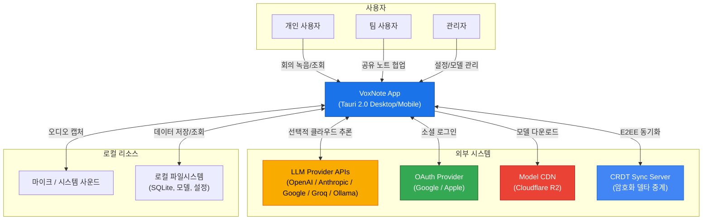
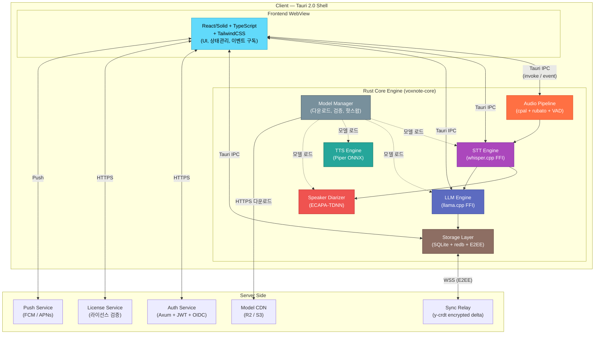
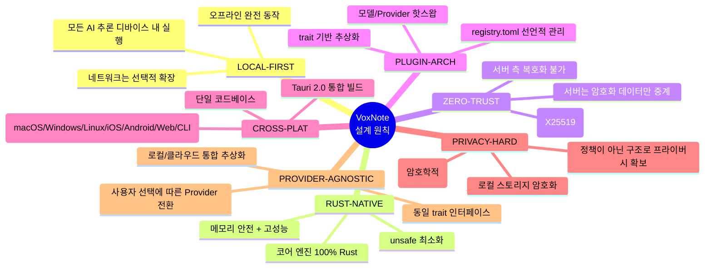

# VoxNote 시스템 아키텍처 개요

> 최종 갱신: 2026-03-27 | 버전: 0.1.0-draft

---

## 1. 개요

VoxNote는 **로컬 AI 기반 회의록 자동 생성 서비스**이다. 음성 인식(STT), 화자 분리, 요약 생성, 텍스트 음성 변환(TTS)까지 모든 AI 추론을 사용자 디바이스에서 수행하며, 서버는 인증, 라이선스 검증, 암호화된 동기화 중계만 담당한다.

### 설계 철학

| 철학 | 설명 |
|------|------|
| **Privacy-First** | 음성 데이터가 디바이스를 떠나지 않는다. 동기화 시에도 서버는 복호화 불가(E2EE). |
| **Local-First** | 네트워크 없이도 전사, 요약, 검색이 가능하다. 클라우드는 선택적 확장이다. |
| **Rust-Native** | 코어 엔진 전체를 Rust로 작성하여 메모리 안전성, 성능, 크로스 플랫폼 이식성을 확보한다. |

---

## 2. C4 Context 다이어그램

시스템 최상위 수준에서 VoxNote와 외부 액터의 관계를 나타낸다.

---

## 3. C4 Container 다이어그램

VoxNote의 클라이언트 측과 서버 측 컨테이너 구성을 나타낸다.

---

## 4. 설계 원칙

---

## 5. 기술 스택 요약

| 계층 | 기술 | 비고 |
|------|------|------|
| **UI 프레임워크** | React (또는 Solid) + TypeScript | SPA, WebView 렌더링 |
| **스타일링** | TailwindCSS + Radix UI | 유틸리티-퍼스트, 접근성 |
| **데스크톱/모바일 셸** | Tauri 2.0 | Rust 기반, WebView2/WKWebView |
| **코어 언어** | Rust (edition 2021) | voxnote-core 크레이트 |
| **오디오 캡처** | cpal | 크로스 플랫폼 오디오 I/O |
| **리샘플링** | rubato | 비동기 리샘플러 |
| **음성 감지(VAD)** | Silero VAD / webrtc-vad | ONNX Runtime 추론 |
| **음성 인식(STT)** | whisper.cpp (whisper-rs) | GGML 양자화 모델 |
| **LLM 추론** | llama.cpp (llama-cpp-rs) | GGUF Q4_K_M 양자화 |
| **TTS** | Piper (piper-rs) | ONNX VITS 기반 |
| **화자 분리** | ECAPA-TDNN | ONNX Runtime, 온라인 클러스터링 |
| **로컬 DB** | SQLite 3 + FTS5 | rusqlite, 전문 검색 |
| **KV 스토어** | redb | 임베디드 Rust KV |
| **암호화** | age (X25519 + ChaCha20-Poly1305) | E2EE, 파일 + 동기화 |
| **CRDT** | y-crdt (yrs) | 오프라인 병합, 실시간 협업 |
| **서버 프레임워크** | Axum | Tokio 기반 비동기 HTTP |
| **인증** | JWT + OIDC (Google, Apple) | OAuth 2.0 소셜 로그인 |
| **모델 저장소** | Cloudflare R2 / S3 | CDN 배포, SHA-256 무결성 검증 |
| **푸시 알림** | FCM / APNs | 모바일 알림 |
| **빌드/CI** | Cargo + pnpm + Tauri CLI | GitHub Actions |

---

## 부록: 용어 정의

| 용어 | 정의 |
|------|------|
| STT | Speech-to-Text. 음성을 텍스트로 변환 |
| TTS | Text-to-Speech. 텍스트를 음성으로 변환 |
| VAD | Voice Activity Detection. 음성 구간 감지 |
| CRDT | Conflict-free Replicated Data Type. 충돌 없는 분산 데이터 구조 |
| E2EE | End-to-End Encryption. 종단 간 암호화 |
| GGUF | GPT-Generated Unified Format. llama.cpp 양자화 모델 포맷 |
| GGML | GPT-Generated Model Library. whisper.cpp 양자화 모델 포맷 |
| FFI | Foreign Function Interface. Rust에서 C/C++ 라이브러리 호출 |
