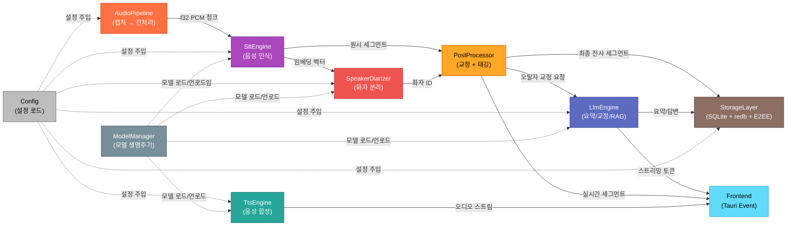
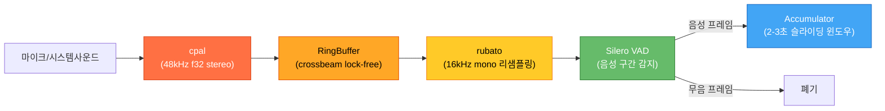
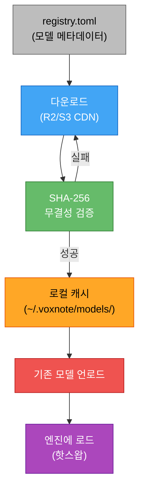
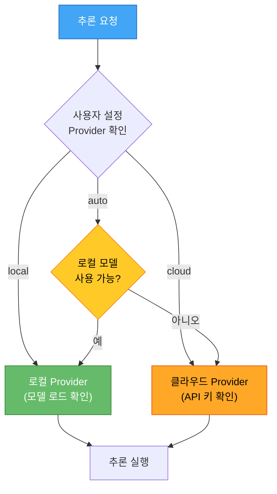

# VoxNote 코어 엔진 상세 설계

> 최종 갱신: 2026-03-27 | 버전: 0.1.0-draft

---

## 1. 개요

`voxnote-core`는 VoxNote의 모든 AI 추론과 데이터 처리를 담당하는 Rust 크레이트이다. Tauri 2.0 Shell 내부에서 동작하며, Frontend WebView와는 Tauri IPC(invoke/event)로 통신한다.

### 핵심 책임

- 오디오 캡처 및 전처리 (마이크, 시스템 사운드)
- 실시간 음성 인식 (STT)
- 화자 분리 (Speaker Diarization)
- LLM 기반 요약/교정/질의응답
- 텍스트 음성 변환 (TTS)
- 로컬 암호화 저장 및 검색
- 모델 생명주기 관리 (다운로드, 검증, 로드, 핫스왑)

### 크레이트 구조

```
voxnote-core/
  src/
    lib.rs              # 퍼사드, 공개 API
    audio/              # AudioPipeline
    stt/                # SttEngine + Provider trait
    llm/                # LlmEngine + Provider trait
    tts/                # TtsEngine + Provider trait
    diarize/            # SpeakerDiarizer
    storage/            # SQLite + redb + E2EE
    model_manager/      # 다운로드, 검증, 핫스왑
    config/             # 설정 로드, feature flag
    error.rs            # 통합 에러 타입
```

---

## 2. 코어 엔진 컴포넌트 다이어그램



---

## 3. 각 컴포넌트 상세 설명

### 3.1 AudioPipeline

오디오 입력 장치에서 실시간으로 PCM 데이터를 캡처하고, STT 엔진이 소비할 수 있는 형태로 전처리한다.



| 단계 | 라이브러리 | 설명 |
|------|-----------|------|
| 캡처 | `cpal` | 마이크/시스템 사운드를 48kHz f32 stereo로 캡처 |
| 버퍼링 | `crossbeam` | lock-free ring buffer로 오디오 스레드와 처리 스레드 분리 |
| 리샘플링 | `rubato` | 48kHz stereo를 16kHz mono로 변환 (Whisper 입력 규격) |
| 음성 감지 | `Silero VAD` / `webrtc-vad` | 무음 구간 필터링, CPU 절약 |
| 축적 | 내부 구현 | 2~3초 슬라이딩 윈도우, 0.5초 오버랩으로 연속성 보장 |

### 3.2 SttEngine

whisper.cpp를 FFI로 호출하여 실시간 음성 인식을 수행한다.

| 항목 | 설명 |
|------|------|
| **바인딩** | `whisper-rs` (whisper.cpp의 Rust FFI 래퍼) |
| **모델** | GGML 양자화 (tiny ~ large-v3-turbo), 사용자 선택 |
| **슬라이딩 윈도우** | 2~3초 청크, 0.5초 오버랩, 이전 텍스트를 `initial_prompt`로 전달하여 문맥 유지 |
| **다국어** | `language` 파라미터 또는 자동 감지 (`detect_language`) |
| **커스텀 단어장** | `initial_prompt`에 고유명사/전문용어 삽입 |
| **출력** | `Vec<Segment>` — 텍스트, 시작/종료 타임스탬프, 토큰 확률 |

### 3.3 LlmEngine

llama.cpp를 FFI로 호출하여 요약 생성, 오탈자 교정, RAG 질의응답을 수행한다.

| 항목 | 설명 |
|------|------|
| **바인딩** | `llama-cpp-rs` (llama.cpp의 Rust FFI 래퍼) |
| **모델** | GGUF Q4_K_M 양자화 (Llama 3, Gemma 2, Phi-3 등) |
| **세션 풀링** | 모델 로드 비용을 줄이기 위해 세션 풀 유지 (최대 N개) |
| **GBNF Grammar** | JSON, Markdown 등 구조화된 출력 강제 |
| **스트리밍** | 토큰 단위 `Stream<Item = Token>` 반환, Tauri Event로 Frontend 전달 |
| **컨텍스트 윈도우** | 4K~32K 토큰, 모델별 동적 조정 |

### 3.4 TtsEngine

텍스트를 음성으로 변환한다. 요약 읽어주기, 접근성 등에 활용된다.

| 항목 | 설명 |
|------|------|
| **엔진** | Piper (VITS 기반 ONNX 모델) |
| **바인딩** | `piper-rs` 또는 직접 ONNX Runtime FFI |
| **다국어** | 한국어, 영어, 일본어 등 다국어 음성 모델 지원 |
| **출력** | f32 PCM 스트림 → cpal 재생 또는 WAV 파일 저장 |

### 3.5 SpeakerDiarizer

실시간으로 화자를 식별하고 각 발화 구간에 화자 레이블을 부여한다.

| 항목 | 설명 |
|------|------|
| **모델** | ECAPA-TDNN (ONNX Runtime) |
| **임베딩** | 각 발화 구간에서 192차원 화자 임베딩 추출 |
| **클러스터링** | 온라인 클러스터링 (코사인 유사도 임계값 기반) |
| **화자 등록** | 사전 등록된 화자 프로필과 매칭 가능 |
| **출력** | 각 세그먼트에 `speaker_id: String` 태깅 |

### 3.6 StorageLayer

모든 데이터를 로컬에 암호화하여 저장하고, 전문 검색 및 벡터 검색을 지원한다.

| 컴포넌트 | 역할 |
|----------|------|
| **SQLite + FTS5** | 전사 텍스트, 요약, 메타데이터 저장. FTS5로 한국어/영어 전문 검색 |
| **redb** | 세션 상태, 캐시, 임시 KV 저장 (임베디드 Rust KV, 트랜잭션 지원) |
| **age (X25519)** | E2EE 암호화. ChaCha20-Poly1305 대칭키 + X25519 키교환 |
| **임베딩 BLOB** | 벡터 임베딩을 SQLite BLOB 컬럼에 저장, 코사인 유사도 검색 |

### 3.7 ModelManager

AI 모델의 전체 생명주기를 관리한다.



| 기능 | 설명 |
|------|------|
| **registry.toml** | 모델 이름, URL, SHA-256, 크기, 호환 엔진, 최소 RAM 등 선언 |
| **증분 다운로드** | HTTP Range 요청으로 이어받기 지원 |
| **SHA-256 검증** | 다운로드 완료 후 해시 비교, 불일치 시 재다운로드 |
| **핫스왑** | 런타임에 모델 교체. 기존 세션 drain 후 새 모델 로드 |
| **디스크 관리** | LRU 기반 자동 정리, 사용자 설정 최대 용량 |

---

## 4. Provider 추상화 클래스 다이어그램

모든 AI 엔진은 trait 기반으로 추상화되어 로컬 추론과 클라우드 API를 동일한 인터페이스로 사용할 수 있다.

```mermaid
classDiagram
    class SttProvider {
        <<trait>>
        +transcribe(audio: AudioChunk) Segments
        +supported_languages() Vec~Language~
        +set_initial_prompt(prompt: String)
    }

    class LocalSttProvider {
        -model: WhisperModel
        -ctx: WhisperContext
        +transcribe(audio: AudioChunk) Segments
        +supported_languages() Vec~Language~
        +set_initial_prompt(prompt: String)
    }

    class OpenAiSttProvider {
        -api_key: String
        -client: HttpClient
        +transcribe(audio: AudioChunk) Segments
        +supported_languages() Vec~Language~
        +set_initial_prompt(prompt: String)
    }

    class GoogleSttProvider {
        -credentials: ServiceAccount
        -client: HttpClient
        +transcribe(audio: AudioChunk) Segments
        +supported_languages() Vec~Language~
        +set_initial_prompt(prompt: String)
    }

    SttProvider <|.. LocalSttProvider : implements
    SttProvider <|.. OpenAiSttProvider : implements
    SttProvider <|.. GoogleSttProvider : implements

    class LlmProvider {
        <<trait>>
        +generate(prompt: Prompt) Stream~Token~
        +max_context_length() usize
        +supports_grammar() bool
    }

    class LocalLlmProvider {
        -model: LlamaModel
        -session_pool: SessionPool
        +generate(prompt: Prompt) Stream~Token~
        +max_context_length() usize
        +supports_grammar() bool
    }

    class OpenAiLlmProvider {
        -api_key: String
        -model_id: String
        +generate(prompt: Prompt) Stream~Token~
        +max_context_length() usize
        +supports_grammar() bool
    }

    class AnthropicLlmProvider {
        -api_key: String
        -model_id: String
        +generate(prompt: Prompt) Stream~Token~
        +max_context_length() usize
        +supports_grammar() bool
    }

    class GeminiLlmProvider {
        -api_key: String
        +generate(prompt: Prompt) Stream~Token~
        +max_context_length() usize
        +supports_grammar() bool
    }

    class OllamaLlmProvider {
        -base_url: String
        -model_name: String
        +generate(prompt: Prompt) Stream~Token~
        +max_context_length() usize
        +supports_grammar() bool
    }

    class CustomLlmProvider {
        -endpoint: Url
        -headers: HeaderMap
        +generate(prompt: Prompt) Stream~Token~
        +max_context_length() usize
        +supports_grammar() bool
    }

    LlmProvider <|.. LocalLlmProvider : implements
    LlmProvider <|.. OpenAiLlmProvider : implements
    LlmProvider <|.. AnthropicLlmProvider : implements
    LlmProvider <|.. GeminiLlmProvider : implements
    LlmProvider <|.. OllamaLlmProvider : implements
    LlmProvider <|.. CustomLlmProvider : implements

    class TtsProvider {
        <<trait>>
        +synthesize(text: String) AudioStream
        +available_voices() Vec~Voice~
        +set_voice(voice: Voice)
    }

    class LocalTtsProvider {
        -model: PiperModel
        -voice: Voice
        +synthesize(text: String) AudioStream
        +available_voices() Vec~Voice~
        +set_voice(voice: Voice)
    }

    class OpenAiTtsProvider {
        -api_key: String
        -voice: String
        +synthesize(text: String) AudioStream
        +available_voices() Vec~Voice~
        +set_voice(voice: Voice)
    }

    TtsProvider <|.. LocalTtsProvider : implements
    TtsProvider <|.. OpenAiTtsProvider : implements
```



### Provider 선택 로직



---

## 5. Feature Flag 매핑 테이블

Cargo feature flag를 통해 빌드 타겟과 기능을 세밀하게 제어한다.

| Feature Flag | 기본값 | 설명 | 활성화 대상 |
|-------------|--------|------|------------|
| `stt` | ON | 음성 인식 (whisper.cpp) | `LocalSttProvider` |
| `llm` | ON | LLM 추론 (llama.cpp) | `LocalLlmProvider` |
| `tts` | OFF | 텍스트 음성 변환 (Piper) | `LocalTtsProvider` |
| `diarize` | ON | 화자 분리 (ECAPA-TDNN) | `SpeakerDiarizer` |
| `metal` | OFF | Apple Metal GPU 가속 | macOS/iOS, whisper.cpp + llama.cpp |
| `cuda` | OFF | NVIDIA CUDA GPU 가속 | Linux/Windows, whisper.cpp + llama.cpp |
| `vulkan` | OFF | Vulkan GPU 가속 | 크로스 플랫폼 대안 |
| `desktop` | ON | 데스크톱 전용 기능 | 시스템 사운드 캡처, 글로벌 단축키 |
| `mobile` | OFF | 모바일 전용 기능 | 배터리 최적화, 간소화 UI |
| `wasm` | OFF | WebAssembly 타겟 | 웹 데모, 제한된 기능 |
| `sync` | OFF | CRDT 동기화 | y-crdt, WebSocket 클라이언트 |
| `cloud-providers` | OFF | 클라우드 AI Provider | OpenAI, Anthropic, Google, Groq API |

### Feature Flag 조합 예시

```toml
# 데스크톱 풀빌드 (macOS, Metal GPU)
[features]
default = ["stt", "llm", "diarize", "desktop", "metal", "sync"]

# 모바일 경량빌드
[features]
default = ["stt", "llm", "diarize", "mobile", "cloud-providers"]

# 웹 데모
[features]
default = ["wasm", "cloud-providers"]
```

---

## 부록: 의존성 크레이트 요약

| 크레이트 | 버전 | 용도 |
|----------|------|------|
| `whisper-rs` | 0.13+ | whisper.cpp FFI 바인딩 |
| `llama-cpp-rs` | 0.4+ | llama.cpp FFI 바인딩 |
| `cpal` | 0.15+ | 크로스 플랫폼 오디오 I/O |
| `rubato` | 0.14+ | 비동기 리샘플링 |
| `crossbeam` | 0.8+ | lock-free 자료구조 |
| `ort` | 2.0+ | ONNX Runtime 바인딩 (VAD, Diarizer, TTS) |
| `rusqlite` | 0.31+ | SQLite 바인딩 |
| `redb` | 2.0+ | 임베디드 KV 스토어 |
| `age` | 0.10+ | 파일 암호화 (X25519) |
| `yrs` | 0.18+ | y-crdt Rust 구현 |
| `tokio` | 1.x | 비동기 런타임 |
| `serde` | 1.x | 직렬화/역직렬화 |
| `tauri` | 2.x | 데스크톱/모바일 앱 셸 |
