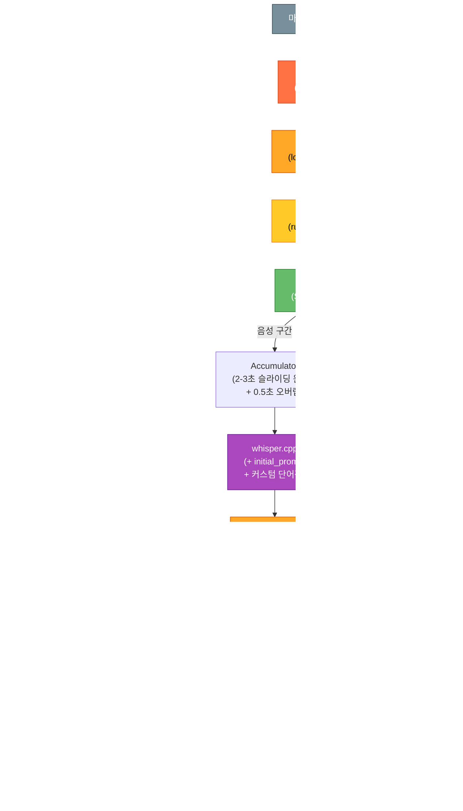
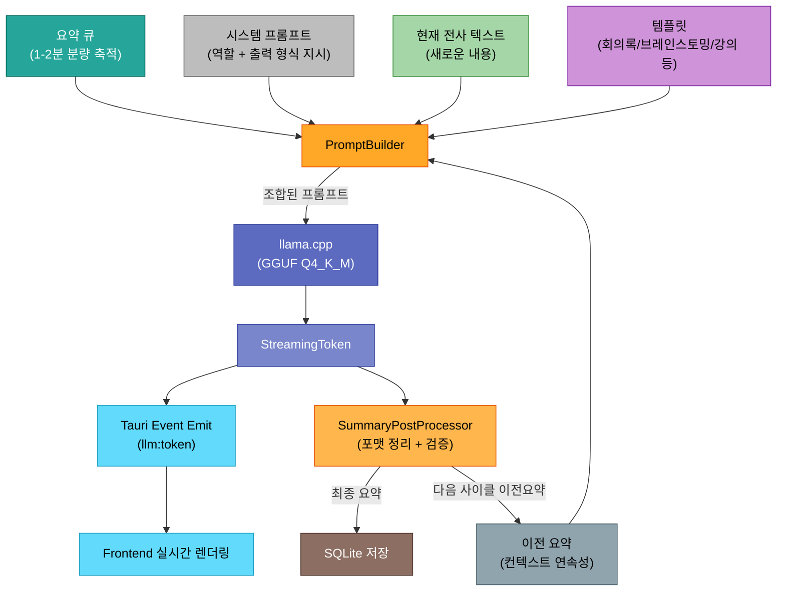
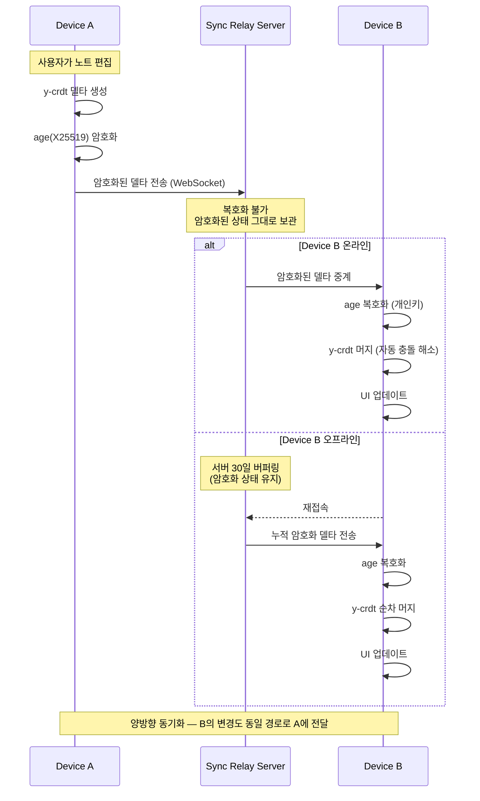
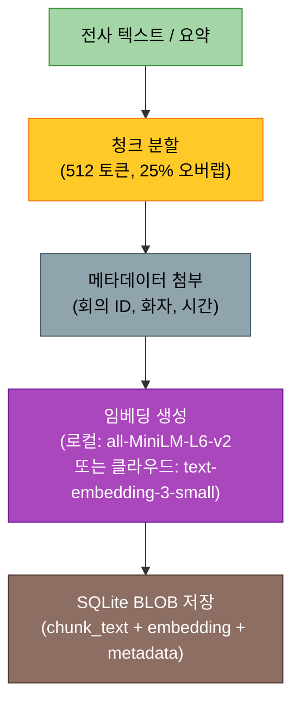
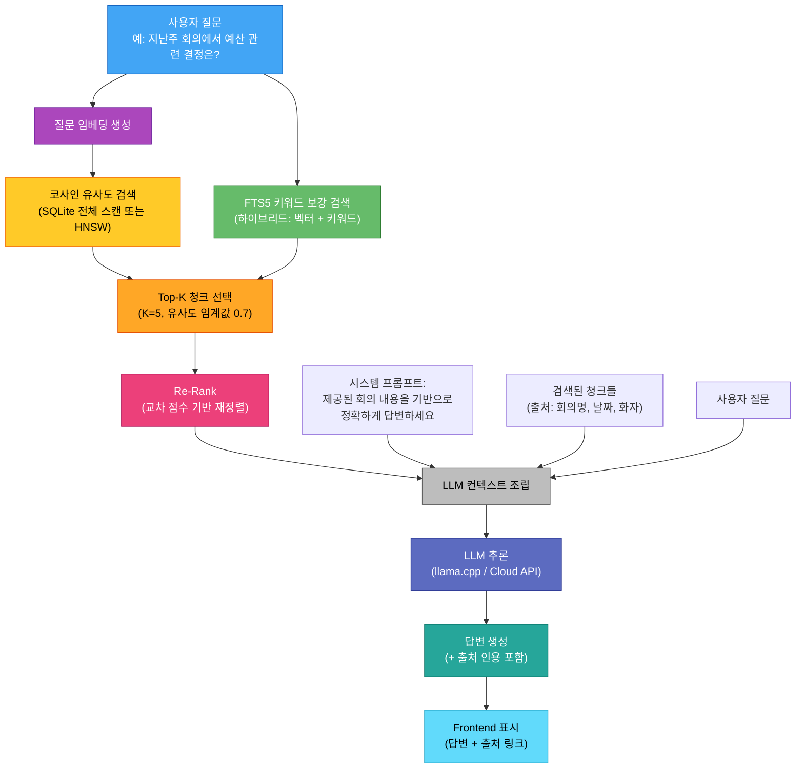
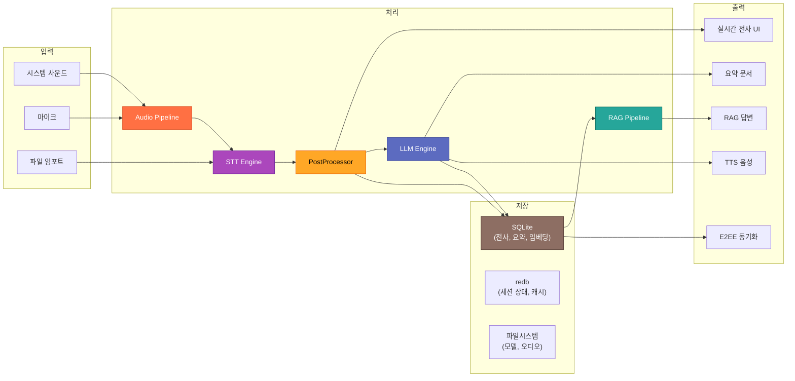

# VoxNote 데이터 흐름 파이프라인

> 최종 갱신: 2026-03-27 | 버전: 0.1.0-draft

---

## 1. 실시간 전사 파이프라인

마이크 또는 시스템 사운드에서 캡처된 오디오가 텍스트로 변환되어 Frontend에 표시되기까지의 전체 흐름이다.



### 파이프라인 성능 지표

| 구간 | 목표 지연 | 비고 |
|------|----------|------|
| cpal 캡처 → RingBuffer | < 5ms | lock-free, 실시간 스레드 |
| RingBuffer → 리샘플링 | < 10ms | rubato 비동기 처리 |
| VAD 판정 | < 2ms | 30ms 프레임 단위 |
| Whisper 추론 (3초 청크) | < 500ms | large-v3-turbo 기준, Metal 가속 |
| PostProcessor 전체 | < 100ms | 병렬 처리 |
| **End-to-End 지연** | **< 1초** | 발화 종료 → 텍스트 표시 |

---

## 2. 요약/문서 생성 파이프라인

전사된 텍스트를 축적하여 주기적으로 요약을 생성하는 파이프라인이다.



### PromptBuilder 구성

```
┌──────────────────────────────────────────────┐
│ [시스템 프롬프트]                               │
│ 당신은 회의록 요약 전문 AI입니다.                  │
│ 한국어로 작성하고 Markdown 형식을 따르세요.         │
├──────────────────────────────────────────────┤
│ [이전 요약] (있는 경우)                          │
│ ## 이전 회의 요약                                │
│ - 핵심 안건 1 ...                               │
│ - 결정 사항 ...                                  │
├──────────────────────────────────────────────┤
│ [현재 전사 텍스트]                               │
│ [00:15:30] 화자A: 다음 분기 계획에 대해...         │
│ [00:15:45] 화자B: 예산은 어떻게...                │
├──────────────────────────────────────────────┤
│ [템플릿 지시]                                    │
│ 다음 항목으로 정리: 핵심 안건, 결정 사항,            │
│ 액션 아이템, 미해결 이슈                           │
└──────────────────────────────────────────────┘
```

### 요약 생성 파라미터

| 파라미터 | 값 | 설명 |
|---------|-----|------|
| 모델 | Q4_K_M 양자화 | 속도/품질 균형 |
| 컨텍스트 윈도우 | 8192 토큰 | 충분한 전사 텍스트 수용 |
| Temperature | 0.3 | 낮은 창의성, 높은 정확성 |
| Top-P | 0.9 | 누적 확률 기반 샘플링 |
| 반복 페널티 | 1.1 | 반복 표현 억제 |
| GBNF Grammar | Markdown 구조 | 출력 형식 강제 |

---

## 3. CRDT 동기화 시퀀스

여러 디바이스 간 노트를 E2EE 상태로 동기화하는 흐름이다. 서버는 암호화된 데이터를 중계할 뿐, 내용을 열람할 수 없다.



### 동기화 프로토콜 상세

```mermaid
flowchart LR
    subgraph "발신 디바이스"
        EDIT["노트 편집<br/>(텍스트/메타데이터)"]
        YDOC["y-crdt Doc"]
        DELTA["델타 추출<br/>(encode_state_as_update)"]
        ENC["age 암호화<br/>(X25519 + ChaCha20)"]
        WS_SEND["WebSocket 전송"]
    end

    subgraph "Sync Relay"
        RECV["수신"]
        STORE["암호화 버퍼<br/>(30일 TTL)"]
        FWD["대상 디바이스에 전달"]
    end

    subgraph "수신 디바이스"
        WS_RECV["WebSocket 수신"]
        DEC["age 복호화"]
        MERGE["y-crdt 머지<br/>(apply_update)"]
        UI["UI 반영"]
    end

    EDIT --> YDOC --> DELTA --> ENC --> WS_SEND
    WS_SEND --> RECV --> STORE --> FWD
    FWD --> WS_RECV --> DEC --> MERGE --> UI

    style ENC fill:#ef5350,stroke:#b71c1c,color:#fff
    style DEC fill:#66bb6a,stroke:#2e7d32,color:#fff
    style STORE fill:#78909c,stroke:#37474f,color:#fff
```



### 충돌 해소 전략

| 시나리오 | CRDT 해소 방식 |
|---------|---------------|
| 같은 위치 동시 삽입 | 삽입 순서를 클라이언트 ID 기준으로 결정 |
| 같은 텍스트 동시 삭제 | 멱등 삭제 — 이미 삭제된 항목 무시 |
| 메타데이터 동시 수정 | Last-Writer-Wins Register (LWW) |
| 오프라인 장기 편집 후 머지 | 모든 연산이 교환 법칙 충족, 순서 무관 머지 |

---

## 4. Ask VoxNote (RAG) 파이프라인

저장된 회의 전사 텍스트를 기반으로 사용자의 자연어 질문에 답변하는 RAG(Retrieval-Augmented Generation) 파이프라인이다.

### 4.1 인덱싱 파이프라인 (오프라인)

새로운 전사/요약이 저장될 때 비동기적으로 임베딩을 생성하여 벡터 검색을 준비한다.



### 4.2 질의 파이프라인 (온라인)

사용자가 질문을 입력하면 관련 청크를 검색하고, LLM에 주입하여 답변을 생성한다.



### RAG 파라미터

| 파라미터 | 값 | 설명 |
|---------|-----|------|
| 청크 크기 | 512 토큰 | 의미 단위 보존과 검색 정밀도 균형 |
| 청크 오버랩 | 25% (128 토큰) | 청크 경계에서의 문맥 손실 방지 |
| 임베딩 모델 (로컬) | all-MiniLM-L6-v2 | 384차원, ONNX Runtime |
| 임베딩 모델 (클라우드) | text-embedding-3-small | 1536차원, OpenAI API |
| Top-K | 5 | 최대 5개 관련 청크 선택 |
| 유사도 임계값 | 0.7 | 이 이상만 컨텍스트에 포함 |
| 하이브리드 가중치 | 벡터 0.7 + 키워드 0.3 | 의미 검색과 키워드 검색 병합 |
| LLM Temperature | 0.2 | 사실 기반 답변을 위해 낮게 설정 |
| 최대 컨텍스트 | 4096 토큰 | 시스템 프롬프트 + 청크 + 질문 |

---

## 부록: 전체 데이터 흐름 요약


