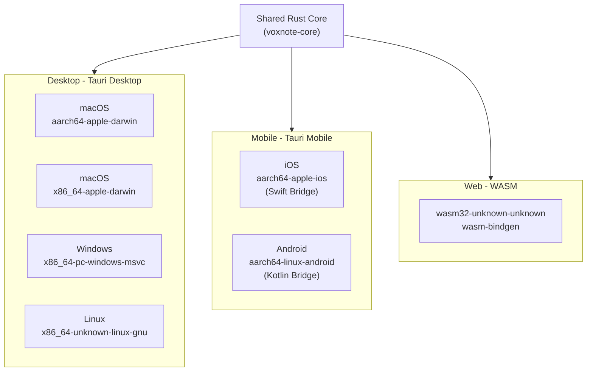
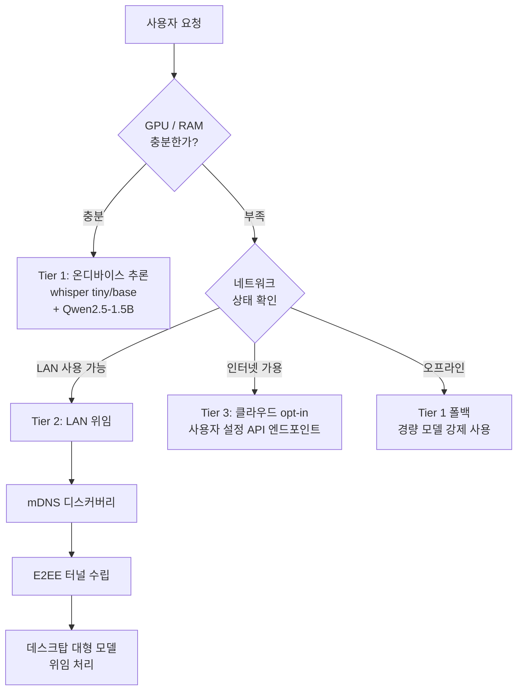
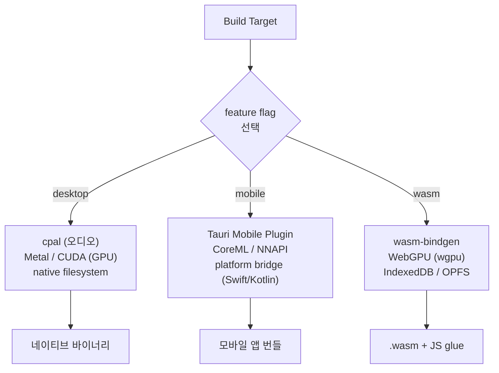

# 04. 크로스플랫폼 배포 전략

> VoxNote는 단일 Rust 코어를 공유하며, Tauri를 통해 데스크탑/모바일, WASM을 통해 웹까지 지원한다.

---

## 1. 크로스플랫폼 아키텍처



---

## 2. 플랫폼별 상세

| 플랫폼 | 타겟 트리플 | GPU | 오디오 캡처 | 패키징 | 최소 사양 |
|---|---|---|---|---|---|
| macOS Apple Silicon | `aarch64-apple-darwin` | Metal | CoreAudio + ScreenCaptureKit | `.dmg` / `.app` | M1+, 8 GB RAM |
| macOS Intel | `x86_64-apple-darwin` | CPU only | CoreAudio | `.dmg` | Intel Core i5+, 8 GB RAM |
| Windows | `x86_64-pc-windows-msvc` | CUDA / Vulkan | WASAPI Loopback | `.msi` / `.exe` | 4 Core, 8 GB RAM |
| Linux | `x86_64-unknown-linux-gnu` | CUDA / Vulkan | PulseAudio / PipeWire | `.AppImage` / `.deb` / `.rpm` | 4 Core, 8 GB RAM |
| iOS | `aarch64-apple-ios` | CoreML | AVAudioEngine (Swift) | `.ipa` | A15 Bionic+ |
| Android | `aarch64-linux-android` | NNAPI / Vulkan | AudioRecord (Kotlin) | `.apk` / `.aab` | Snapdragon 8 Gen1+ |
| Web | `wasm32-unknown-unknown` | WebGPU | MediaDevices API | Static Hosting | 최신 브라우저 (Chrome 113+) |

---

## 3. 모바일 계층형 전략

모바일 환경에서는 디바이스 성능에 따라 추론 전략을 자동으로 결정한다.



### Tier 요약

| Tier | 조건 | 모델 | 지연시간 | 프라이버시 |
|---|---|---|---|---|
| Tier 1 | GPU/RAM 충분 | whisper tiny/base + Qwen2.5-1.5B | 최저 | 완전 로컬 |
| Tier 2 | LAN 내 데스크탑 존재 | 데스크탑의 대형 모델 | 낮음 | LAN 내 E2EE |
| Tier 3 | 인터넷 가용 + 사용자 동의 | 클라우드 모델 | 중간 | 사용자 책임 |
| Tier 1 폴백 | 오프라인 + 저사양 | whisper tiny | 높음 | 완전 로컬 |

---

## 4. WASM 전략

웹 타겟에서는 조건부 컴파일을 통해 WASM 전용 경로를 사용한다.

### 조건부 컴파일

```rust
#[cfg(target_arch = "wasm32")]
mod wasm {
    use wasm_bindgen::prelude::*;

    #[wasm_bindgen]
    pub async fn transcribe(audio: &[u8]) -> Result<String, JsValue> {
        // WebGPU 백엔드로 whisper tiny/base 실행
        // ...
    }
}

#[cfg(not(target_arch = "wasm32"))]
mod native {
    pub async fn transcribe(audio: &[u8]) -> Result<String, anyhow::Error> {
        // Metal / CUDA / CPU 네이티브 백엔드
        // ...
    }
}
```

### WASM 제약 사항

| 항목 | 제약 | 대응 |
|---|---|---|
| 모델 크기 | 브라우저 메모리 한계 | tiny / base 모델만 지원 |
| GPU | WebGPU만 가용 | `wgpu` 크레이트의 WebGPU 백엔드 |
| 파일 시스템 | 없음 | IndexedDB + OPFS로 대체 |
| 스레딩 | SharedArrayBuffer 필요 | COOP/COEP 헤더 설정 필수 |
| 오디오 입력 | MediaDevices API | HTTPS 필수, 사용자 권한 요청 |

---

## 5. 조건부 컴파일 다이어그램



### Cargo.toml feature 구성 예시

```toml
[features]
default = ["desktop"]
desktop = ["cpal", "metal", "cuda"]
mobile  = ["tauri-plugin-mobile", "coreml", "nnapi"]
wasm    = ["wasm-bindgen", "web-sys", "js-sys"]
```

### 빌드 명령 예시

```bash
# Desktop (macOS Apple Silicon)
cargo build --release --target aarch64-apple-darwin --features desktop

# iOS
cargo build --release --target aarch64-apple-ios --features mobile

# WASM
cargo build --release --target wasm32-unknown-unknown --features wasm
wasm-bindgen target/wasm32-unknown-unknown/release/voxnote_core.wasm --out-dir pkg
```
