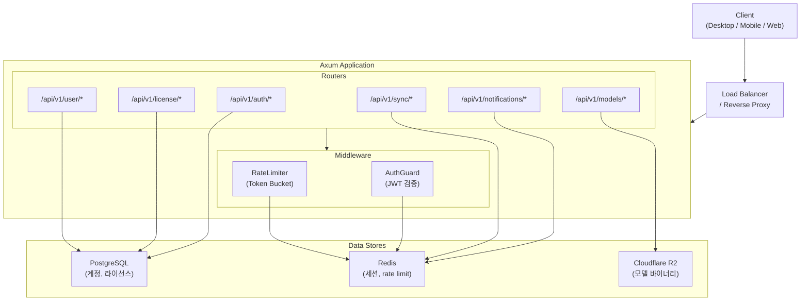
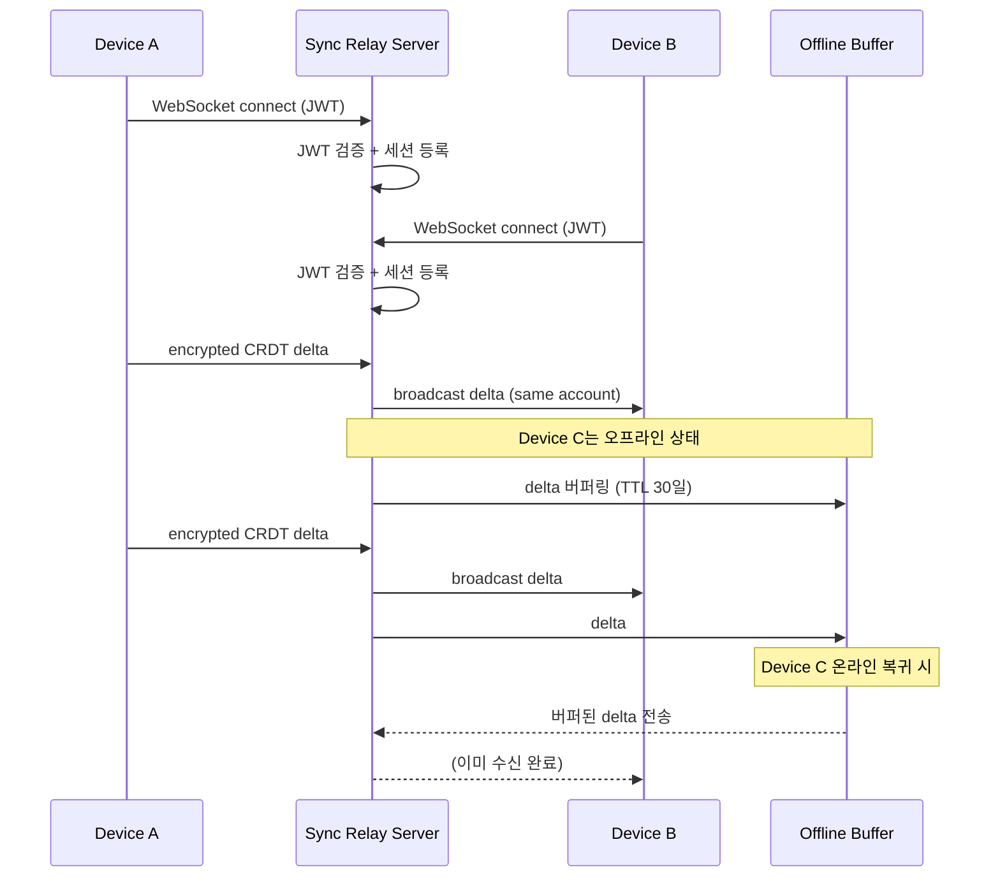
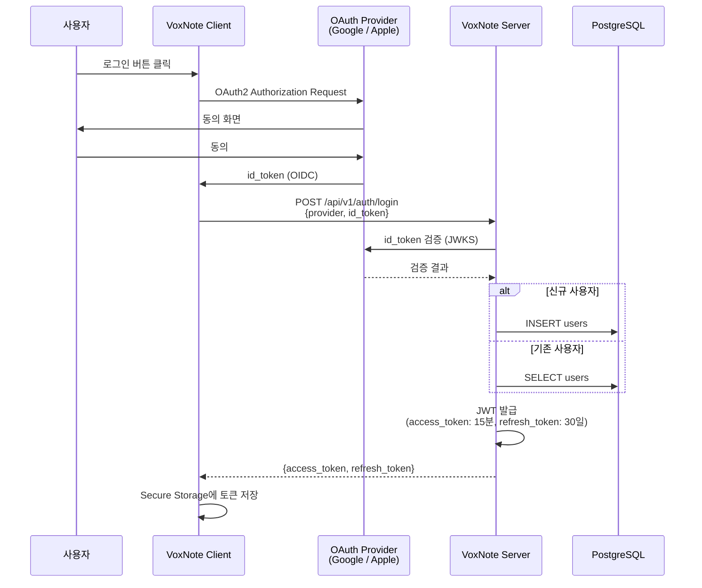

# 05. 서버 아키텍처 (최소 구성)

> VoxNote의 서버는 최소한의 역할만 담당한다: 인증, 라이선스 관리, 푸시 알림, CRDT 동기화 릴레이.
> 모든 AI 추론은 클라이언트에서 실행되며 서버는 사용자 데이터를 저장하지 않는다.

---

## 1. 서버 기술 스택

| 계층 | 기술 | 용도 |
|---|---|---|
| Framework | Axum 0.8 + Tower | HTTP/WebSocket 서버 |
| Auth | JWT (RS256) + OAuth2 (Google / Apple OIDC) | 인증 및 토큰 발급 |
| Database | PostgreSQL | 사용자 계정, 라이선스 관리 |
| Cache | Redis | 세션 관리, Rate Limiting |
| Push | FCM / APNs | 모바일 푸시 알림 |
| Sync | y-crdt relay | 멀티디바이스 CRDT 동기화 |
| CDN / Storage | Cloudflare R2 | 모델 바이너리 배포 |
| Deploy | fly.io / Railway | 서버 배포 및 오케스트레이션 |

---

## 2. 서버 컴포넌트 다이어그램



---

## 3. API 엔드포인트 전체 목록

### Auth (`/api/v1/auth`)

| Method | Path | 설명 | 인증 |
|---|---|---|---|
| `POST` | `/api/v1/auth/login` | OAuth2 id_token으로 로그인, JWT 발급 | Public |
| `GET` | `/api/v1/auth/refresh` | Access Token 갱신 | Refresh Token |
| `DELETE` | `/api/v1/auth/logout` | 세션 무효화 | Bearer JWT |

### License (`/api/v1/license`)

| Method | Path | 설명 | 인증 |
|---|---|---|---|
| `GET` | `/api/v1/license/verify` | 현재 라이선스 상태 확인 | Bearer JWT |
| `POST` | `/api/v1/license/activate` | 디바이스에 라이선스 활성화 | Bearer JWT |
| `DELETE` | `/api/v1/license/deactivate` | 디바이스 라이선스 비활성화 | Bearer JWT |

### Notifications (`/api/v1/notifications`)

| Method | Path | 설명 | 인증 |
|---|---|---|---|
| `POST` | `/api/v1/notifications/register` | 푸시 토큰 등록 (FCM/APNs) | Bearer JWT |
| `PUT` | `/api/v1/notifications/settings` | 알림 설정 변경 | Bearer JWT |

### Sync (`/api/v1/sync`)

| Method | Path | 설명 | 인증 |
|---|---|---|---|
| `WS` | `/api/v1/sync/connect` | CRDT 동기화 WebSocket 연결 | Bearer JWT |
| `GET` | `/api/v1/sync/status` | 동기화 상태 조회 | Bearer JWT |

### Models (`/api/v1/models`)

| Method | Path | 설명 | 인증 |
|---|---|---|---|
| `GET` | `/api/v1/models/catalog` | 사용 가능한 모델 목록 | Bearer JWT |
| `GET` | `/api/v1/models/:id/download` | 모델 다운로드 URL (서명된 R2 URL) | Bearer JWT |

### User (`/api/v1/user`)

| Method | Path | 설명 | 인증 |
|---|---|---|---|
| `GET` | `/api/v1/user/profile` | 사용자 프로필 조회 | Bearer JWT |
| `PUT` | `/api/v1/user/profile` | 사용자 프로필 수정 | Bearer JWT |
| `DELETE` | `/api/v1/user/account` | 계정 삭제 (GDPR) | Bearer JWT |

---

## 4. CRDT 동기화 릴레이 상세

서버는 CRDT 델타를 해석하지 않으며, 암호화된 바이너리를 그대로 릴레이한다.



### 릴레이 규칙

| 항목 | 값 | 설명 |
|---|---|---|
| 버퍼 TTL | 30일 | 오프라인 디바이스를 위한 최대 보관 기간 |
| 최대 델타 크기 | 1 MB | 단일 메시지 최대 크기 |
| 암호화 | E2EE (client-side) | 서버는 평문을 볼 수 없음 |
| 압축 | zstd | 전송 전 클라이언트에서 압축 |
| 프로토콜 | WebSocket + Binary frames | 텍스트 프레임 미사용 |

---

## 5. 인증 플로우



### JWT 구조

```json
{
  "header": {
    "alg": "RS256",
    "typ": "JWT"
  },
  "payload": {
    "sub": "user_uuid",
    "email": "user@example.com",
    "iat": 1711526400,
    "exp": 1711527300,
    "iss": "voxnote-server",
    "aud": "voxnote-client"
  }
}
```

| 토큰 | 유효기간 | 저장 위치 |
|---|---|---|
| Access Token | 15분 | 메모리 |
| Refresh Token | 30일 | Secure Storage (Keychain / KeyStore) |
