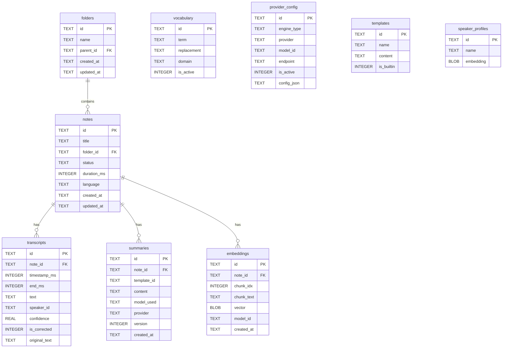
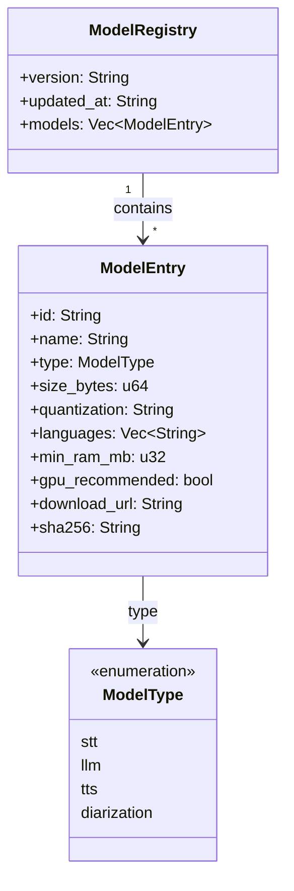
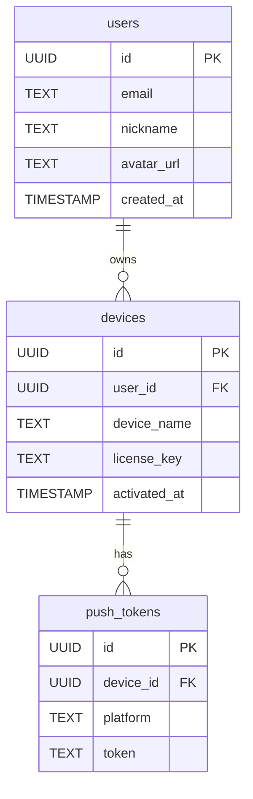

# 06. 데이터 모델

> VoxNote의 로컬 데이터는 SQLite에 저장되며, 서버에는 최소한의 계정/라이선스 정보만 존재한다.

---

## 1. SQLite ER 다이어그램



### 테이블 상세

#### `folders` -- 폴더 (계층 구조)

| 컬럼 | 타입 | 설명 |
|---|---|---|
| `id` | TEXT PK | UUID v7 |
| `name` | TEXT NOT NULL | 폴더 이름 |
| `parent_id` | TEXT FK | 상위 폴더 (NULL = 루트) |
| `created_at` | TEXT | ISO 8601 |
| `updated_at` | TEXT | ISO 8601 |

#### `notes` -- 노트

| 컬럼 | 타입 | 설명 |
|---|---|---|
| `id` | TEXT PK | UUID v7 |
| `title` | TEXT | 노트 제목 |
| `folder_id` | TEXT FK | 소속 폴더 |
| `status` | TEXT | `recording` / `transcribing` / `summarizing` / `done` / `error` |
| `duration_ms` | INTEGER | 녹음 길이 (밀리초) |
| `language` | TEXT | BCP-47 언어 코드 (예: `ko`, `en`) |
| `created_at` | TEXT | ISO 8601 |
| `updated_at` | TEXT | ISO 8601 |

#### `transcripts` -- 전사 세그먼트

| 컬럼 | 타입 | 설명 |
|---|---|---|
| `id` | TEXT PK | UUID v7 |
| `note_id` | TEXT FK | 소속 노트 |
| `timestamp_ms` | INTEGER | 시작 시간 (밀리초) |
| `end_ms` | INTEGER | 종료 시간 (밀리초) |
| `text` | TEXT | 전사 텍스트 |
| `speaker_id` | TEXT | 화자 식별자 |
| `confidence` | REAL | 신뢰도 (0.0 ~ 1.0) |
| `is_corrected` | INTEGER | 사용자 수정 여부 (0/1) |
| `original_text` | TEXT | 수정 전 원문 (수정 시에만 존재) |

#### `summaries` -- 요약

| 컬럼 | 타입 | 설명 |
|---|---|---|
| `id` | TEXT PK | UUID v7 |
| `note_id` | TEXT FK | 소속 노트 |
| `template_id` | TEXT | 사용된 템플릿 |
| `content` | TEXT | 요약 내용 (Markdown) |
| `model_used` | TEXT | 사용된 모델명 |
| `provider` | TEXT | `local` / `lan` / `cloud` |
| `version` | INTEGER | 재생성 시 버전 증가 |
| `created_at` | TEXT | ISO 8601 |

#### `embeddings` -- 벡터 임베딩

| 컬럼 | 타입 | 설명 |
|---|---|---|
| `id` | TEXT PK | UUID v7 |
| `note_id` | TEXT FK | 소속 노트 |
| `chunk_idx` | INTEGER | 청크 순서 |
| `chunk_text` | TEXT | 원문 청크 |
| `vector` | BLOB | f32 벡터 (직렬화) |
| `model_id` | TEXT | 임베딩 모델 식별자 |
| `created_at` | TEXT | ISO 8601 |

#### `vocabulary` -- 사용자 사전

| 컬럼 | 타입 | 설명 |
|---|---|---|
| `id` | TEXT PK | UUID v7 |
| `term` | TEXT | 인식 대상 용어 |
| `replacement` | TEXT | 치환 텍스트 |
| `domain` | TEXT | 도메인 분류 (예: `medical`, `legal`) |
| `is_active` | INTEGER | 활성 여부 (0/1) |

#### `provider_config` -- 엔진 설정

| 컬럼 | 타입 | 설명 |
|---|---|---|
| `id` | TEXT PK | UUID v7 |
| `engine_type` | TEXT | `stt` / `llm` / `tts` / `embedding` |
| `provider` | TEXT | `local` / `openai` / `anthropic` 등 |
| `model_id` | TEXT | 모델 식별자 |
| `endpoint` | TEXT | API 엔드포인트 (클라우드 사용 시) |
| `is_active` | INTEGER | 활성 여부 (0/1) |
| `config_json` | TEXT | 추가 설정 (JSON) |

#### `templates` -- 요약 템플릿

| 컬럼 | 타입 | 설명 |
|---|---|---|
| `id` | TEXT PK | UUID v7 |
| `name` | TEXT | 템플릿 이름 |
| `content` | TEXT | 프롬프트 템플릿 본문 |
| `is_builtin` | INTEGER | 내장 여부 (0/1) |

#### `speaker_profiles` -- 화자 프로필

| 컬럼 | 타입 | 설명 |
|---|---|---|
| `id` | TEXT PK | UUID v7 |
| `name` | TEXT | 화자 이름 |
| `embedding` | BLOB | 화자 임베딩 벡터 |

---

## 2. 전문검색 (FTS5) 구조

SQLite FTS5를 활용하여 전사 텍스트에 대한 전문검색을 지원한다.

### 가상 테이블

```sql
CREATE VIRTUAL TABLE transcript_fts USING fts5(
    text,
    content='transcripts',
    content_rowid='rowid',
    tokenize='unicode61 remove_diacritics 2'
);
```

### 자동 동기화 트리거

```sql
-- INSERT 트리거
CREATE TRIGGER transcript_fts_insert AFTER INSERT ON transcripts
BEGIN
    INSERT INTO transcript_fts(rowid, text) VALUES (NEW.rowid, NEW.text);
END;

-- UPDATE 트리거
CREATE TRIGGER transcript_fts_update AFTER UPDATE OF text ON transcripts
BEGIN
    INSERT INTO transcript_fts(transcript_fts, rowid, text) VALUES ('delete', OLD.rowid, OLD.text);
    INSERT INTO transcript_fts(rowid, text) VALUES (NEW.rowid, NEW.text);
END;

-- DELETE 트리거
CREATE TRIGGER transcript_fts_delete AFTER DELETE ON transcripts
BEGIN
    INSERT INTO transcript_fts(transcript_fts, rowid, text) VALUES ('delete', OLD.rowid, OLD.text);
END;
```

### 검색 예시

```sql
-- 단순 검색
SELECT t.*, n.title
FROM transcript_fts fts
JOIN transcripts t ON t.rowid = fts.rowid
JOIN notes n ON n.id = t.note_id
WHERE transcript_fts MATCH '회의 AND 결론'
ORDER BY rank;

-- 하이라이트 포함 검색
SELECT highlight(transcript_fts, 0, '<mark>', '</mark>') AS highlighted,
       t.note_id, t.timestamp_ms
FROM transcript_fts fts
JOIN transcripts t ON t.rowid = fts.rowid
WHERE transcript_fts MATCH '프로젝트 일정';
```

---

## 3. 모델 레지스트리 구조

로컬에 저장되는 `registry.toml`은 사용 가능한 모델 목록과 메타데이터를 관리한다.



### `registry.toml` 예시

```toml
version = "1.0.0"
updated_at = "2026-03-27T00:00:00Z"

[[models]]
id = "whisper-large-v3-turbo-q8"
name = "Whisper Large V3 Turbo (Q8_0)"
type = "stt"
size_bytes = 874_512_384
quantization = "Q8_0"
languages = ["ko", "en", "ja", "zh", "es", "fr", "de"]
min_ram_mb = 2048
gpu_recommended = true
download_url = "https://models.voxnote.app/whisper-large-v3-turbo-q8.gguf"
sha256 = "a1b2c3d4e5f6..."

[[models]]
id = "qwen2.5-7b-q4km"
name = "Qwen2.5 7B (Q4_K_M)"
type = "llm"
size_bytes = 4_368_785_408
quantization = "Q4_K_M"
languages = ["ko", "en", "ja", "zh"]
min_ram_mb = 8192
gpu_recommended = true
download_url = "https://models.voxnote.app/qwen2.5-7b-q4km.gguf"
sha256 = "f6e5d4c3b2a1..."

[[models]]
id = "whisper-tiny-q8"
name = "Whisper Tiny (Q8_0)"
type = "stt"
size_bytes = 78_643_200
quantization = "Q8_0"
languages = ["ko", "en"]
min_ram_mb = 512
gpu_recommended = false
download_url = "https://models.voxnote.app/whisper-tiny-q8.gguf"
sha256 = "1a2b3c4d5e6f..."

[[models]]
id = "pyannote-segmentation-3"
name = "Pyannote Segmentation 3.0"
type = "diarization"
size_bytes = 17_825_792
quantization = "fp16"
languages = ["*"]
min_ram_mb = 512
gpu_recommended = false
download_url = "https://models.voxnote.app/pyannote-seg3.onnx"
sha256 = "abcdef123456..."
```

---

## 4. 서버 DB 스키마 (PostgreSQL, 최소)

서버는 사용자 계정, 디바이스, 푸시 토큰만 관리한다. 노트/전사/요약 데이터는 서버에 저장되지 않는다.



### DDL

```sql
CREATE TABLE users (
    id          UUID PRIMARY KEY DEFAULT gen_random_uuid(),
    email       TEXT NOT NULL UNIQUE,
    nickname    TEXT,
    avatar_url  TEXT,
    created_at  TIMESTAMP WITH TIME ZONE DEFAULT now()
);

CREATE TABLE devices (
    id            UUID PRIMARY KEY DEFAULT gen_random_uuid(),
    user_id       UUID NOT NULL REFERENCES users(id) ON DELETE CASCADE,
    device_name   TEXT NOT NULL,
    license_key   TEXT NOT NULL UNIQUE,
    activated_at  TIMESTAMP WITH TIME ZONE DEFAULT now()
);

CREATE INDEX idx_devices_user_id ON devices(user_id);

CREATE TABLE push_tokens (
    id          UUID PRIMARY KEY DEFAULT gen_random_uuid(),
    device_id   UUID NOT NULL REFERENCES devices(id) ON DELETE CASCADE,
    platform    TEXT NOT NULL CHECK (platform IN ('ios', 'android', 'web')),
    token       TEXT NOT NULL,
    UNIQUE (device_id, platform)
);

CREATE INDEX idx_push_tokens_device_id ON push_tokens(device_id);
```
