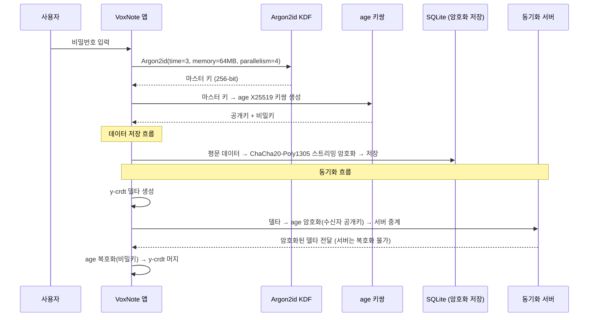
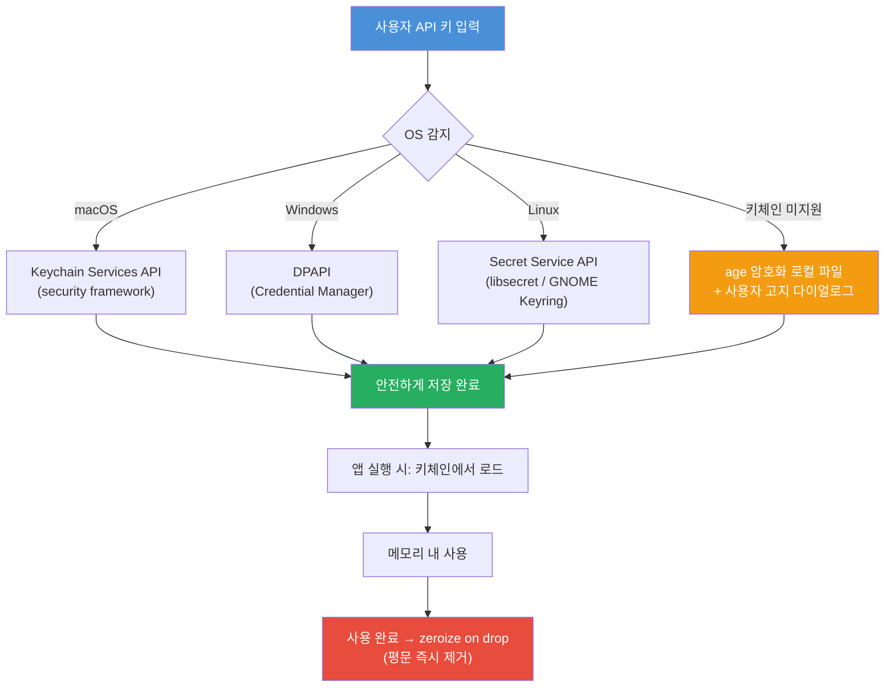
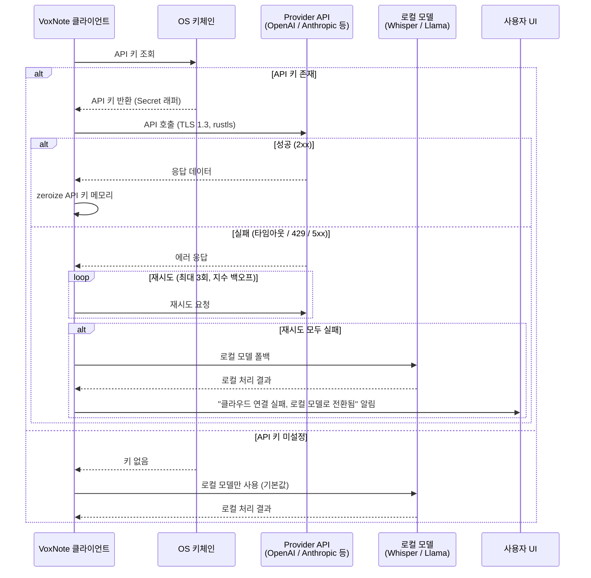
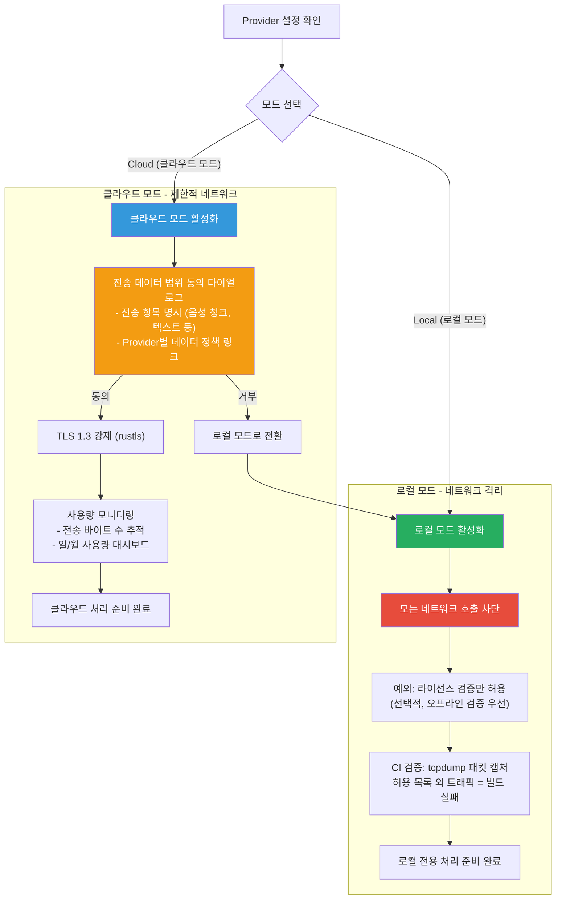
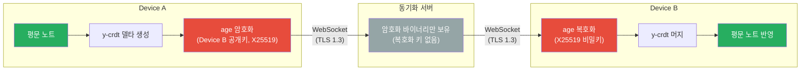

# 07. 보안 아키텍처

> VoxNote는 **사용자 데이터에 대한 제로 트러스트** 원칙을 기반으로 설계되었다.
> 서버는 사용자의 음성, 노트, API 키 어떤 것에도 접근할 수 없으며,
> 로컬 모드에서는 네트워크 전송 경로 자체가 존재하지 않는다.

---

## 1. 보안 설계 원칙

| 원칙 | 설명 |
|------|------|
| **ZERO-TRUST** | 서버는 사용자 데이터에 접근 불가. 동기화 서버도 암호화된 바이너리만 중계한다. |
| **PRIVACY-HARD** | 기술적 보장 방식. 로컬 모드 시 데이터 전송 경로 자체가 없다 (CI에서 tcpdump로 검증). |
| **E2EE** | 저장(at-rest)과 동기화(in-transit) 모두 종단간 암호화. age(X25519) + ChaCha20-Poly1305 사용. |
| **외부 API 투명성** | 클라우드 Provider 사용 시 전송되는 데이터 범위를 명확히 고지하고 사용자 동의를 받는다. |

---

## 2. E2EE 키 관리 흐름

사용자 비밀번호에서 마스터 키를 파생하고, 이를 기반으로 모든 암호화 작업을 수행한다.



### 키 파생 파라미터

| 파라미터 | 값 | 근거 |
|----------|-----|------|
| Algorithm | Argon2id | 메모리-하드 + GPU 저항성 |
| Time cost | 3 iterations | OWASP 권장 최소값 |
| Memory cost | 64 MB | 모바일 디바이스 호환 |
| Parallelism | 4 threads | 일반적인 모바일 코어 수 |
| Output | 256-bit | ChaCha20-Poly1305 키 길이 |

---

## 3. API 키 보안 저장 흐름

외부 Provider(OpenAI, Anthropic 등)의 API 키는 OS 네이티브 키체인에 저장하며, 메모리 내 평문 노출을 최소화한다.



### 메모리 보안 정책

- API 키는 `secrecy::Secret<String>` 래퍼로 관리
- `Drop` 시 `zeroize` 트레이트로 메모리 즉시 초기화
- `Debug`, `Display` 트레이트 구현 차단 (로그 노출 방지)
- 스왑 파일 노출 방지: `mlock()` 호출로 해당 메모리 페이지 잠금

---

## 4. Provider 인증 흐름

클라우드 Provider API 호출 시 인증 및 장애 대응 흐름이다.



### TLS 정책

- **라이브러리**: `rustls` (OpenSSL 의존성 제거)
- **최소 버전**: TLS 1.3 강제
- **인증서 검증**: `webpki-roots` 시스템 인증서 + Mozilla CA 번들
- **인증서 고정(Pinning)**: 주요 Provider에 대해 HPKP 적용 검토

---

## 5. 로컬 모드 네트워크 격리

로컬 모드 선택 시 라이선스 검증을 제외한 모든 네트워크 호출을 차단한다.



### CI 네트워크 격리 검증 스크립트 (개념)

```bash
# 로컬 모드 빌드에서 허용되지 않은 네트워크 트래픽 감지
tcpdump -i any -c 100 -w /tmp/voxnote_traffic.pcap &
TCPDUMP_PID=$!
cargo test --features local-only
kill $TCPDUMP_PID
# 허용 목록(license.voxnote.dev) 외 트래픽 존재 시 실패
python3 scripts/verify_no_traffic.py /tmp/voxnote_traffic.pcap
```

---

## 6. 동기화 보안

디바이스 간 동기화 시 서버는 암호화된 바이너리만 중계하며, 복호화 키를 보유하지 않는다.



### 동기화 프로토콜 상세

1. **디바이스 등록**: 각 디바이스는 최초 실행 시 age X25519 키쌍을 생성하고, 공개키를 서버에 등록한다.
2. **키 교환**: 동일 계정의 디바이스들은 서로의 공개키를 서버를 통해 교환한다 (공개키이므로 서버 노출 무방).
3. **델타 암호화**: 변경 사항(y-crdt 델타)을 수신 디바이스의 공개키로 각각 암호화한다.
4. **서버 중계**: 서버는 암호화된 바이너리를 저장/전달만 하며, 복호화가 불가능하다.
5. **충돌 해결**: y-crdt의 CRDT 특성으로 복호화 후 자동 머지된다 (서버 개입 불필요).

### 서버가 알 수 있는 정보 vs 알 수 없는 정보

| 서버가 아는 것 | 서버가 모르는 것 |
|---------------|-----------------|
| 암호화된 바이너리 크기 | 노트 내용 (텍스트, 음성) |
| 동기화 시각 | 노트 제목, 태그 |
| 디바이스 공개키 | API 키 |
| 대략적 활동 패턴 | 검색 쿼리, 요약 내용 |

---

## 7. 보안 검증 매트릭스

| 항목 | 기법 | 도구 | 검증 시점 |
|------|------|------|-----------|
| **E2EE 저장** | DB 직접 조회로 평문 부재 확인 | `hex dump` / `sqlite3` | 매 빌드 (CI) |
| **네트워크 격리** | 패킷 캡처로 미허가 트래픽 감지 | `tcpdump` | CI (로컬 모드 빌드) |
| **API 키 보안** | 파일시스템 전체 스캔으로 평문 키 탐지 | `grep` / `rg` | CI (매 빌드) |
| **메모리 보안** | 프로세스 메모리 덤프에서 평문 키 탐지 | `gdb` / `lldb` | 릴리즈 전 수동 검증 |
| **암호화 구현** | 코드 리뷰 + 정적 분석 | `clippy` + 수동 리뷰 | PR 리뷰 시 |
| **퍼징** | 암호화/복호화 경로 입력 퍼징 | `cargo-fuzz`, `AFL++` | 주간 스케줄 (CI) |
| **의존성 취약점** | 알려진 취약점 데이터베이스 조회 | `cargo audit` | 매 빌드 (CI) |
| **라이선스 컴플라이언스** | 의존성 라이선스 검증 | `cargo deny` | PR 리뷰 시 |

---

## 부록: 위협 모델 요약

| 위협 | 대응 | 잔여 위험 |
|------|------|-----------|
| 서버 침해 | E2EE로 암호화 바이너리만 유출 가능 | 메타데이터(동기화 시각, 크기) 노출 |
| 디바이스 분실 | 로컬 DB 전체 암호화 (ChaCha20-Poly1305) | 디바이스 잠금 해제 상태에서 분실 시 |
| API 키 탈취 | OS 키체인 + zeroize on drop | 키체인 자체의 OS 취약점 |
| 중간자 공격 | TLS 1.3 강제 + 인증서 검증 | 국가급 CA 침해 시나리오 |
| 메모리 포렌식 | mlock + zeroize | 콜드부트 공격 (극히 낮은 확률) |
