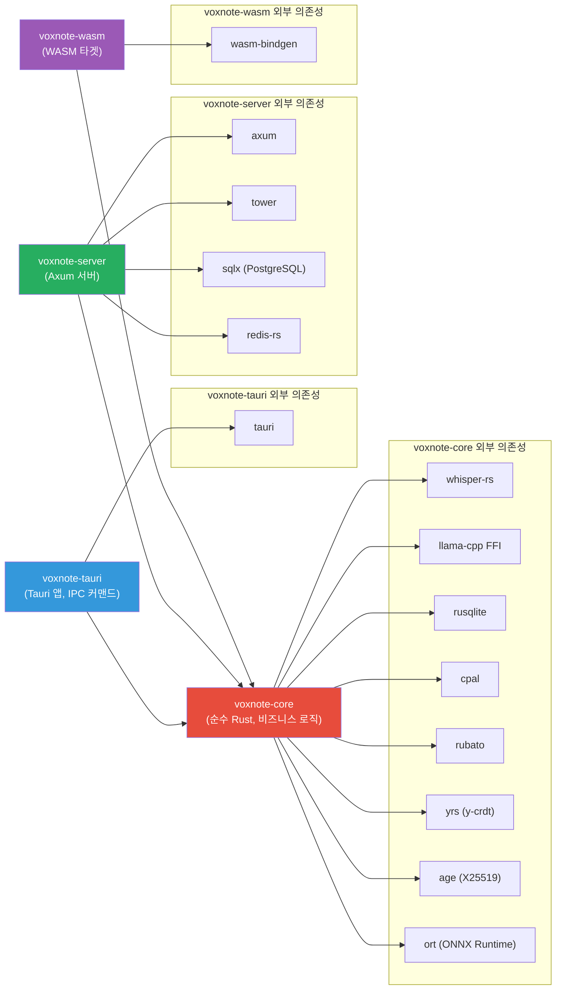
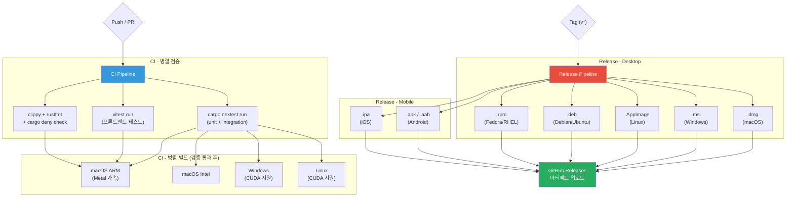

# 08. 프로젝트 구조 & 빌드 시스템

> VoxNote는 Cargo 워크스페이스 기반의 모노레포로 구성되며,
> 데스크톱(Tauri), 모바일(Tauri Mobile), 웹(WASM), 서버를 단일 코드베이스에서 관리한다.

---

## 1. Cargo 워크스페이스 의존성 다이어그램



> **의존성 규칙**: `voxnote-core`는 Tauri, Axum 등 프레임워크에 의존하지 않는 순수 Rust 크레이트이다.
> 모든 플랫폼 크레이트(`tauri`, `server`, `wasm`)가 `core`에 의존하며, 역방향 의존은 금지한다.

---

## 2. 전체 디렉토리 구조

```
voxnote/
├── Cargo.toml                          # 워크스페이스 루트
├── Cargo.lock
├── rust-toolchain.toml                 # Rust 툴체인 고정
├── deny.toml                           # cargo-deny 설정
│
├── crates/
│   ├── voxnote-core/                   # 핵심 비즈니스 로직
│   │   ├── Cargo.toml
│   │   └── src/
│   │       ├── lib.rs                  # 크레이트 루트 (pub mod 선언)
│   │       ├── config.rs               # 앱 설정 구조체 + 직렬화
│   │       ├── audio/
│   │       │   ├── mod.rs              # 오디오 캡처/재생 추상화
│   │       │   ├── capture.rs          # cpal 기반 마이크 캡처
│   │       │   ├── playback.rs         # 오디오 재생
│   │       │   └── resample.rs         # rubato 기반 리샘플링 (→16kHz)
│   │       ├── stt/
│   │       │   ├── mod.rs              # STT 트레이트 정의
│   │       │   ├── whisper.rs          # whisper-rs 로컬 엔진
│   │       │   └── cloud.rs            # 클라우드 STT Provider
│   │       ├── llm/
│   │       │   ├── mod.rs              # LLM 트레이트 정의
│   │       │   ├── local.rs            # llama.cpp FFI 로컬 엔진
│   │       │   └── cloud.rs            # 클라우드 LLM Provider
│   │       ├── tts/
│   │       │   ├── mod.rs              # TTS 트레이트 정의
│   │       │   └── onnx.rs             # ort 기반 로컬 TTS
│   │       ├── diarize/
│   │       │   ├── mod.rs              # 화자분리 트레이트
│   │       │   └── onnx.rs             # ort 기반 화자분리
│   │       ├── storage/
│   │       │   ├── mod.rs              # 저장소 추상화
│   │       │   ├── sqlite.rs           # rusqlite + ChaCha20-Poly1305 암호화
│   │       │   └── sync.rs             # y-crdt 동기화 로직
│   │       └── models/
│   │           ├── mod.rs              # 도메인 모델
│   │           ├── note.rs             # 노트 구조체
│   │           ├── recording.rs        # 녹음 구조체
│   │           └── tag.rs              # 태그 구조체
│   │
│   ├── voxnote-tauri/                  # Tauri 데스크톱/모바일 앱
│   │   ├── Cargo.toml
│   │   ├── tauri.conf.json
│   │   ├── capabilities/               # Tauri v2 권한 설정
│   │   └── src/
│   │       ├── main.rs                 # Tauri 앱 엔트리포인트
│   │       ├── state.rs                # 앱 상태 관리 (Arc<Mutex<AppState>>)
│   │       ├── commands/
│   │       │   ├── mod.rs
│   │       │   ├── recording.rs        # 녹음 시작/중지/일시정지 IPC
│   │       │   ├── note.rs             # 노트 CRUD IPC
│   │       │   ├── stt.rs              # STT 실행 IPC
│   │       │   ├── llm.rs              # LLM 요약/추출 IPC
│   │       │   └── settings.rs         # 설정 변경 IPC
│   │       └── plugins/
│   │           ├── mod.rs
│   │           └── global_shortcut.rs  # 시스템 전역 단축키
│   │   └── mobile-plugins/
│   │       ├── android/                # Kotlin 네이티브 플러그인
│   │       │   └── src/main/kotlin/
│   │       └── ios/                    # Swift 네이티브 플러그인
│   │           └── Sources/
│   │
│   ├── voxnote-server/                 # 동기화 서버
│   │   ├── Cargo.toml
│   │   └── src/
│   │       ├── main.rs                 # Axum 서버 엔트리포인트
│   │       ├── routes/
│   │       │   ├── mod.rs
│   │       │   ├── sync.rs             # WebSocket 동기화 엔드포인트
│   │       │   ├── auth.rs             # 인증 엔드포인트
│   │       │   └── health.rs           # 헬스체크
│   │       ├── middleware/
│   │       │   ├── mod.rs
│   │       │   ├── auth.rs             # JWT 인증 미들웨어
│   │       │   └── rate_limit.rs       # 요청 제한
│   │       └── db.rs                   # sqlx PostgreSQL 커넥션 풀
│   │
│   └── voxnote-wasm/                   # 웹 브라우저 타겟
│       ├── Cargo.toml
│       └── src/
│           ├── lib.rs                  # wasm-bindgen 엔트리포인트
│           └── wasm_bridge.rs          # JS ↔ Rust 브릿지 함수
│
├── frontend/                           # 프론트엔드 (React + TypeScript)
│   ├── package.json
│   ├── vite.config.ts
│   ├── tsconfig.json
│   ├── index.html
│   └── src/
│       ├── main.tsx                    # React 엔트리포인트
│       ├── App.tsx                     # 루트 컴포넌트
│       ├── components/
│       │   ├── Editor/                 # 노트 에디터 (TipTap/ProseMirror)
│       │   ├── Recorder/              # 녹음 UI
│       │   ├── Sidebar/               # 노트 목록 사이드바
│       │   ├── Settings/              # 설정 패널
│       │   └── common/                # 공통 UI 컴포넌트
│       ├── hooks/
│       │   ├── useRecording.ts        # 녹음 상태 훅
│       │   ├── useNote.ts             # 노트 CRUD 훅
│       │   └── useTauriIPC.ts         # Tauri IPC 래퍼 훅
│       └── stores/
│           ├── noteStore.ts           # 노트 상태 (zustand)
│           ├── recordingStore.ts      # 녹음 상태 (zustand)
│           └── settingsStore.ts       # 설정 상태 (zustand)
│
├── models/                             # AI 모델 관리
│   ├── registry.toml                  # 모델 메타데이터 (이름, URL, 해시, 크기)
│   └── download.sh                    # 모델 다운로드 스크립트
│
├── tests/                              # 워크스페이스 통합 테스트
│   ├── e2e_recording.rs
│   ├── e2e_sync.rs
│   └── e2e_encryption.rs
│
├── benches/                            # Criterion 벤치마크
│   ├── stt_bench.rs
│   ├── encryption_bench.rs
│   └── audio_resample_bench.rs
│
├── fuzz/                               # cargo-fuzz 퍼징 타겟
│   ├── Cargo.toml
│   └── fuzz_targets/
│       ├── fuzz_audio_decode.rs
│       └── fuzz_encryption.rs
│
└── .github/workflows/                  # GitHub Actions
    ├── ci.yml                         # PR/Push: 테스트 + 린트
    ├── build-desktop.yml              # 데스크톱 빌드 매트릭스
    ├── build-mobile.yml               # 모바일 빌드
    └── release.yml                    # 태그 기반 릴리즈
```

---

## 3. Cargo 워크스페이스 설정

```toml
# Cargo.toml (워크스페이스 루트)

[workspace]
resolver = "2"
members = [
    "crates/voxnote-core",
    "crates/voxnote-tauri",
    "crates/voxnote-server",
    "crates/voxnote-wasm",
]

[workspace.package]
version = "0.1.0"
edition = "2021"
rust-version = "1.80"
license = "MIT OR Apache-2.0"
repository = "https://github.com/example/voxnote"

[workspace.dependencies]
# 내부 크레이트
voxnote-core = { path = "crates/voxnote-core" }

# 오디오
cpal = "0.15"
rubato = "0.14"

# AI/ML
whisper-rs = "0.12"
ort = "2.0"

# 암호화
age = "0.10"
chacha20poly1305 = "0.10"
argon2 = "0.5"
secrecy = { version = "0.8", features = ["serde"] }
zeroize = { version = "1", features = ["derive"] }

# 저장소
rusqlite = { version = "0.31", features = ["bundled"] }

# CRDT / 동기화
yrs = "0.18"
tokio-tungstenite = "0.21"

# 직렬화
serde = { version = "1", features = ["derive"] }
serde_json = "1"
toml = "0.8"

# 비동기 런타임
tokio = { version = "1", features = ["full"] }

# 에러 처리
thiserror = "1"
anyhow = "1"

# 로깅
tracing = "0.1"
tracing-subscriber = "0.3"

# HTTP 클라이언트 (클라우드 Provider)
reqwest = { version = "0.12", default-features = false, features = ["rustls-tls", "json"] }

# 서버 전용
axum = "0.7"
tower = "0.4"
tower-http = { version = "0.5", features = ["cors", "trace"] }
sqlx = { version = "0.7", features = ["postgres", "runtime-tokio-rustls"] }
redis = "0.25"

# Tauri 전용
tauri = "2"
tauri-build = "2"

# WASM 전용
wasm-bindgen = "0.2"

[profile.release]
opt-level = 3
lto = "fat"
codegen-units = 1
strip = "symbols"

[profile.dev]
opt-level = 1     # 개발 시에도 최소 최적화 (AI 모델 성능)
```

---

## 4. Feature Flag 구성

```mermaid
graph TD
    Default["default = [stt, llm]"]

    Default --> STT["stt"]
    Default --> LLM["llm"]

    STT --> WhisperRS["whisper-rs"]
    LLM --> LlamaCPP["llama.cpp FFI"]

    TTS["tts"] --> ORT_TTS["ort (ONNX Runtime)"]
    Diarize["diarize"] --> ORT_DIA["ort (ONNX Runtime)"]

    Metal["metal"] --> WhisperMetal["whisper-rs/metal"]
    CUDA["cuda"] --> WhisperCUDA["whisper-rs/cuda"]

    Desktop["desktop"] --> CPAL["cpal (네이티브 오디오)"]
    Mobile["mobile"] --> TauriMobile["Tauri Mobile Plugin"]
    WASM_F["wasm"] --> WasmBindgen["wasm-bindgen"]

    Sync["sync"] --> YRS["yrs (y-crdt)"]
    Sync --> TokioWS["tokio-tungstenite"]

    CloudProviders["cloud-providers"] --> Reqwest["reqwest (rustls)"]

    style Default fill:#e74c3c,color:#fff
    style STT fill:#3498db,color:#fff
    style LLM fill:#3498db,color:#fff
    style TTS fill:#9b59b6,color:#fff
    style Diarize fill:#9b59b6,color:#fff
    style Metal fill:#f39c12,color:#fff
    style CUDA fill:#f39c12,color:#fff
    style Desktop fill:#27ae60,color:#fff
    style Mobile fill:#27ae60,color:#fff
    style WASM_F fill:#27ae60,color:#fff
    style Sync fill:#1abc9c,color:#fff
    style CloudProviders fill:#e67e22,color:#fff
```



### Feature Flag 정의 (voxnote-core/Cargo.toml)

```toml
[features]
default = ["stt", "llm"]

# AI 기능
stt = ["dep:whisper-rs"]
llm = []                           # llama.cpp는 FFI로 직접 링크
tts = ["dep:ort"]
diarize = ["dep:ort"]

# GPU 가속
metal = ["whisper-rs?/metal"]
cuda = ["whisper-rs?/cuda"]

# 플랫폼
desktop = ["dep:cpal"]
mobile = []
wasm = ["dep:wasm-bindgen"]

# 네트워크
sync = ["dep:yrs", "dep:tokio-tungstenite"]
cloud-providers = ["dep:reqwest"]
```

### 플랫폼별 빌드 명령

| 플랫폼 | 빌드 명령 |
|--------|-----------|
| macOS (Apple Silicon) | `cargo build -p voxnote-tauri --features desktop,metal,sync` |
| macOS (Intel) | `cargo build -p voxnote-tauri --features desktop,sync` |
| Windows (CUDA) | `cargo build -p voxnote-tauri --features desktop,cuda,sync` |
| Linux | `cargo build -p voxnote-tauri --features desktop,sync` |
| Android | `cargo tauri android build --features mobile,sync` |
| iOS | `cargo tauri ios build --features mobile,metal,sync` |
| WASM | `cargo build -p voxnote-wasm --target wasm32-unknown-unknown --features wasm` |
| Server | `cargo build -p voxnote-server --features sync` |

---

## 5. CI/CD 빌드 매트릭스



### CI 워크플로 요약 (`.github/workflows/ci.yml`)

```yaml
# 개념적 구조 (실제 설정은 워크플로 파일 참조)
name: CI
on: [push, pull_request]

jobs:
  test:
    strategy:
      matrix:
        os: [ubuntu-latest, macos-latest, windows-latest]
    steps:
      - cargo nextest run --workspace
      - cd frontend && pnpm vitest run

  lint:
    steps:
      - cargo clippy --workspace --all-features -- -D warnings
      - cargo fmt --check
      - cargo deny check

  build:
    needs: [test, lint]
    strategy:
      matrix:
        include:
          - os: macos-14        # ARM
            features: desktop,metal,sync
          - os: macos-13        # Intel
            features: desktop,sync
          - os: windows-latest
            features: desktop,cuda,sync
          - os: ubuntu-latest
            features: desktop,sync
```

---

## 6. 프론트엔드 구조

### package.json 주요 의존성

```json
{
  "name": "voxnote-frontend",
  "private": true,
  "type": "module",
  "scripts": {
    "dev": "vite",
    "build": "tsc && vite build",
    "preview": "vite preview",
    "test": "vitest run",
    "lint": "eslint src/ --ext .ts,.tsx"
  },
  "dependencies": {
    "react": "^19.0.0",
    "react-dom": "^19.0.0",
    "@tauri-apps/api": "^2.0.0",
    "@tauri-apps/plugin-shell": "^2.0.0",
    "@tiptap/react": "^2.5.0",
    "@tiptap/starter-kit": "^2.5.0",
    "zustand": "^5.0.0",
    "react-router-dom": "^7.0.0",
    "lucide-react": "^0.400.0",
    "tailwindcss": "^4.0.0",
    "clsx": "^2.1.0"
  },
  "devDependencies": {
    "@vitejs/plugin-react": "^4.3.0",
    "vite": "^6.0.0",
    "typescript": "^5.5.0",
    "vitest": "^2.0.0",
    "@testing-library/react": "^16.0.0",
    "eslint": "^9.0.0"
  }
}
```

### Vite 설정

```typescript
// vite.config.ts
import { defineConfig } from "vite";
import react from "@vitejs/plugin-react";

export default defineConfig({
  plugins: [react()],

  // Tauri 개발 서버 연동
  clearScreen: false,
  server: {
    port: 1420,
    strictPort: true,
    watch: {
      ignored: ["**/crates/**"],
    },
  },

  build: {
    target: ["es2021", "chrome100", "safari15"],
    minify: !process.env.TAURI_DEBUG ? "esbuild" : false,
    sourcemap: !!process.env.TAURI_DEBUG,
  },
});
```

### Zustand 스토어 패턴

```typescript
// stores/noteStore.ts
import { create } from "zustand";
import { invoke } from "@tauri-apps/api/core";

interface Note {
  id: string;
  title: string;
  content: string;
  createdAt: string;
  updatedAt: string;
  tags: string[];
}

interface NoteStore {
  notes: Note[];
  activeNoteId: string | null;
  isLoading: boolean;
  fetchNotes: () => Promise<void>;
  createNote: (title: string) => Promise<Note>;
  updateNote: (id: string, content: string) => Promise<void>;
  deleteNote: (id: string) => Promise<void>;
  setActiveNote: (id: string) => void;
}

export const useNoteStore = create<NoteStore>((set, get) => ({
  notes: [],
  activeNoteId: null,
  isLoading: false,

  fetchNotes: async () => {
    set({ isLoading: true });
    const notes = await invoke<Note[]>("get_all_notes");
    set({ notes, isLoading: false });
  },

  createNote: async (title) => {
    const note = await invoke<Note>("create_note", { title });
    set((state) => ({ notes: [...state.notes, note] }));
    return note;
  },

  updateNote: async (id, content) => {
    await invoke("update_note", { id, content });
    set((state) => ({
      notes: state.notes.map((n) =>
        n.id === id ? { ...n, content, updatedAt: new Date().toISOString() } : n
      ),
    }));
  },

  deleteNote: async (id) => {
    await invoke("delete_note", { id });
    set((state) => ({
      notes: state.notes.filter((n) => n.id !== id),
      activeNoteId: state.activeNoteId === id ? null : state.activeNoteId,
    }));
  },

  setActiveNote: (id) => set({ activeNoteId: id }),
}));
```

### Tauri IPC 브릿지 패턴

프론트엔드에서 Rust 백엔드를 호출하는 표준 패턴이다.

```typescript
// hooks/useTauriIPC.ts
import { invoke } from "@tauri-apps/api/core";
import { listen, type UnlistenFn } from "@tauri-apps/api/event";
import { useEffect, useRef } from "react";

/**
 * Tauri IPC 커맨드를 호출하는 타입 안전 래퍼.
 * Rust 측 #[tauri::command] 함수와 1:1 매핑된다.
 */
type Commands = {
  // 녹음
  start_recording: { params: { sampleRate: number }; result: string };
  stop_recording: { params: { recordingId: string }; result: void };

  // STT
  transcribe: {
    params: { recordingId: string; language?: string };
    result: { text: string; segments: Segment[] };
  };

  // LLM
  summarize: { params: { text: string; style: string }; result: string };

  // 노트
  get_all_notes: { params: Record<string, never>; result: Note[] };
  create_note: { params: { title: string }; result: Note };
  update_note: { params: { id: string; content: string }; result: void };
  delete_note: { params: { id: string }; result: void };

  // 설정
  get_settings: { params: Record<string, never>; result: Settings };
  update_settings: { params: { settings: Settings }; result: void };
};

export async function tauriInvoke<K extends keyof Commands>(
  command: K,
  args: Commands[K]["params"]
): Promise<Commands[K]["result"]> {
  return invoke(command, args);
}

/**
 * Rust 백엔드에서 발행하는 이벤트를 구독하는 훅.
 * 컴포넌트 언마운트 시 자동으로 구독 해제된다.
 */
export function useTauriEvent<T>(
  event: string,
  handler: (payload: T) => void
) {
  const handlerRef = useRef(handler);
  handlerRef.current = handler;

  useEffect(() => {
    let unlisten: UnlistenFn;

    listen<T>(event, (e) => {
      handlerRef.current(e.payload);
    }).then((fn) => {
      unlisten = fn;
    });

    return () => {
      unlisten?.();
    };
  }, [event]);
}
```

### Rust 측 IPC 커맨드 예시

```rust
// crates/voxnote-tauri/src/commands/recording.rs

use tauri::State;
use voxnote_core::audio::AudioRecorder;
use crate::state::AppState;

#[tauri::command]
pub async fn start_recording(
    state: State<'_, AppState>,
    sample_rate: u32,
) -> Result<String, String> {
    let mut recorder = state.recorder.lock().await;
    let recording_id = recorder
        .start(sample_rate)
        .map_err(|e| e.to_string())?;
    Ok(recording_id)
}

#[tauri::command]
pub async fn stop_recording(
    state: State<'_, AppState>,
    recording_id: String,
) -> Result<(), String> {
    let mut recorder = state.recorder.lock().await;
    recorder
        .stop(&recording_id)
        .map_err(|e| e.to_string())?;
    Ok(())
}
```

---

## 부록: 크레이트별 역할 요약

| 크레이트 | 역할 | 타겟 | 핵심 의존성 |
|----------|------|------|-------------|
| `voxnote-core` | 비즈니스 로직 (오디오, STT, LLM, 저장, 암호화) | 모든 플랫폼 | whisper-rs, rusqlite, age, yrs |
| `voxnote-tauri` | 데스크톱/모바일 앱 셸, IPC 커맨드 | macOS, Windows, Linux, iOS, Android | tauri, voxnote-core |
| `voxnote-server` | 동기화 서버 (암호화 바이너리 중계) | Linux (배포) | axum, sqlx, redis, voxnote-core(sync) |
| `voxnote-wasm` | 웹 브라우저 타겟 | wasm32-unknown-unknown | wasm-bindgen, voxnote-core(wasm) |
